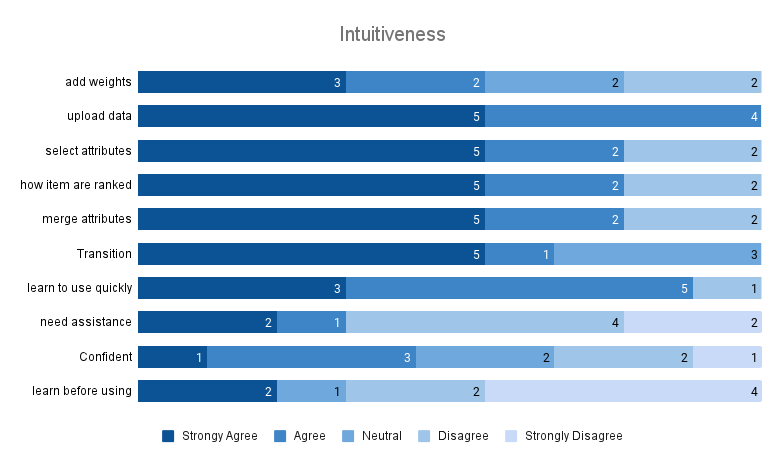

# DNAsmart: DNA Storage Multi-Attribute Ranking Tool

The aim of this tool is to visually represent the effect of attribute weights on the ranking of decoded sequences. To support the ranking of these decoded sequences, from a DNA-based storage system or experiment, the introduction of weights on certain attributes leads to a specific ranking (favoring specific sequences). By relying on sorting and grouping of such attributes, we obtain an interactive change in the ranking of the best sequences. The rationale is to be able to provide insight into the attribute space by using different attribute combinations. For example, which attribute combination leads to the optimal sequence or Top 3 sequences to compare encoding experiments.

## Dependencies
* Node.js

## Usage
**Installation: How to run it locally**
Clone and run:

```bash
npm install
```
to install the tool and its Dependencies.

In the project directory, you can run:

```bash
npm start
```
Runs the tool on your local server.\
Open [http://localhost:3000](http://localhost:3000) to view it in the browser.

### Evaluation 
This repository contains the evaluation Implementation which is used to test the usage of the tool. The evaluation is divided into two steps: the training step and the testing step. The training step is used in order to get familiar with the interactive features of the tool. For each step of the evaluation, there are questions about the usage of the tool. In the training step, hints are provided alongside with the questions to help the user in the usage of the tool. The questions for each step can be found [here](https://github.com/Sombiri/DNAsmart/tree/Evaluate/src/evaluation_question)

### General Usage
1. Install and run the tool on your PC
2. Upload your data sets, click Next
3. Select your DNA storage attribute of choice, click Next
4. Explore the rankings of the decoded sequences

| Image of Sequence View | Selection View | Ranking View |
| --- | --- | --- |
|  |  |  | 


### Data set
1. The data sets for the tool must be a multi-Fasta file
2. Data sets used for the evaluation can be found in [DNAsmart_data](https://github.com/Sombiri/DNAsmart/tree/Evaluate/src/DNAsmart_data) 

### Graphical Chart

| Design Choices | Intuitiveness | Useful for DNA storage |
| --- | --- | --- |
|  |  |  | 

See [here](https://dnasmart.mathematik.uni-marburg.de/) for the online prototype.


